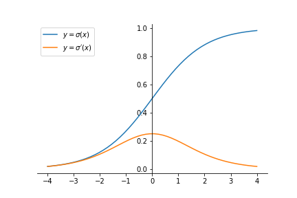
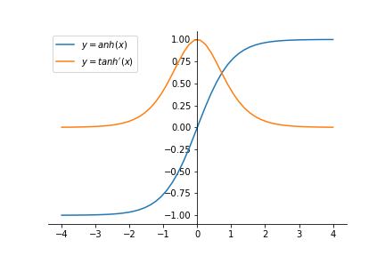

[TOC]

# Sigmoid

$$
\Large{
\begin{split}
  \sigma(z) &= \frac{1}{1 + e^{-z}}\\
  \sigma'(z) & = \sigma(z)(1 - \sigma(z))\\
  \end{split}
}
$$

# Tanh

$$
\Large{
\begin{split}
  \text{tanh}(z) &=\frac{e^{z} - e^{-z}}{e^{z} + e^{-z}}\\
  \text{tanh}'(z) & = 1 - (\text{tanh}(z))^2
  \end{split}
}
$$

