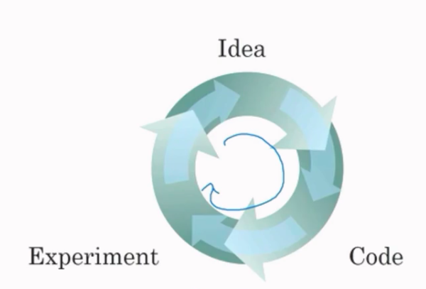
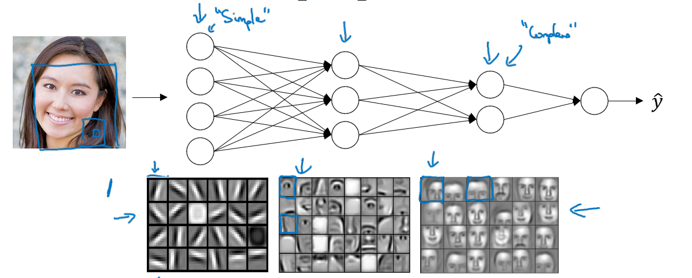
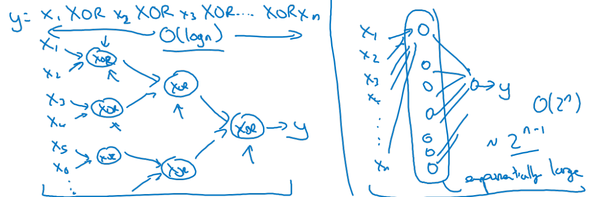

1. What is the difference between Structured Data and Unstructured Data?[here](https://www.coursera.org/learn/neural-networks-deep-learning/lecture/2c38r/supervised-learning-with-neural-networks)

   Structured data is like data of database, which means that each of its feature has specific meaning to human beings. Like in the house prediction problem, size of the house, number of bedrooms, zip code and so on, are all meaningful in some sense and they are lined up so neatly in a structured table form. However, unstructured data is more like pixel values from image and sound volume from audio. These type of data may not make much sense if considered separately but is really natural to us humans from a bigger picture. For examples, you know that there is a cat in the picture, but what is the point of telling you one of the pixels from the cat region is (212, 140, 123)?

2. Why is Deep Learning taking off?

   Scale makes difference. More and more data, bigger and bigger neural network, more and more powerful computing devices(like GPU, TPU and so on). Faster computation actually shortens the production cycle, which makes Deep Learning methods more and more popular in commercial field.

   <center></center>

   3. Be careful with rank 1 arrays in Numpy.

      There are some subtilties when dealing with rank 1 arrays and they might cause bugs if used without caution. For example, the transpose of rank 1 arrays is itself, which is really unexpected. So the best takeaway is to avoid using them in your code. Or if you're not sure about the shape of a specific variable, add a line of assertion `assert (a.shape == (5, 1))`.

      ```Python
      import numpy as np

      a = np.random.randn(5)
      print(a.shape)    # (5,)
      print(a.T.shape)  # (5,)

      assert (a.shape == (5, 1)), "There is a bug!!!"
      ```

   4. Slight difference between **loss function** and **cost function**.

      Technically speaking, there is slight difference between loss function and cost function. Loss function only measures how the model performs at one specific example, while cost function actually cares about how the model performs at the whole training set. Basically, cost function is just the mean of loss values most of the time. You can actually see this difference in some of the framework. Like in TensorFlow, if you apply loss function of `tf.sigmoid_cross_entropy_with_logits` to final output from neural network, it wouldn't perform any kind of reduction(say summation) and just gives you the individual loss values.

   5. Why should we use a different kind of loss function other than Mean Squared Error in logistic regression?

      There may be mathematics behind this. Just release that MSE may result in a non-convex cost function, which is not good for optimization since there exist multiple local minimums.

   6. Which activation function should you use in your own machine learning application?

      So far, ReLU activation is the best choice and you should never use sigmoid activation any more unless in the output unit. But by no means it's the only option. Some other activation functions may actually give a small performance boost in some specific tasks, like the leaky version of ReLU or tanh. So if possible, you may try them out and see what happens.

   7. Another question is: why even bother using an activation function?

   8. Get your matrix dimensions right.

      As in the course, the computation involved in one layer of neural network is as follows:
      $$
      \Large{
      \begin{split}
        Z^{[l]} &= WA^{[l-1]} + b\\
        A^{[l]} &=g(Z^{[l]})
      \end{split}
      }
      $$
      And we use $n_l$ to denote the number of neurons in layer $l$. Here are some of the basic sanity checks about your matrix dimension:

      - $W$ is a $n_l\times n_{l-1}$ matrix, $b$ is a $n_l\times 1$ column vector.
      - $A^{[l]}$ has the same dimension as $Z^{[l]}$ since activation function performs element-wise operation.

   9. Why "deep" neural network? Why not "broad" neural network?

      Two intuitions provided in the course:

      - It's more natural to do things hierarchically. Lower layers learns local textures in the inputs(like, edges in images) and higher layers built on top of them try to assemble these low-level features to form more abstract concepts, like eyes, mouth and so on. At the end, the network figures out that it's a human face. But it would be much more demanding for a shadow network to realize the input image is actually a human face.

        <center></center>

      - Circuit theory, if stated informally, says that **there are functions you can compute with a “small” L-layer deep neural network that shallower networks require exponentially more hidden units to compute.** For example, if we were to learn XOR operation of $n$ variables, then we only need $O(\log(n))$ hidden layers to do that. However, with a 2-layer shallow network, we have to stack $2^n$ neurons in the hidden layer. So it's not that shallow networks are bad, they just need much more neurons to get things done.

        <center></center>

   10. What does this have to do with the brain?

     Technically, there is not much analogy between an artificial neural network hand human brain. Well, you may not be satisfied with this answer. In some sense, an ANN is just a simplified computation model of human brain. 