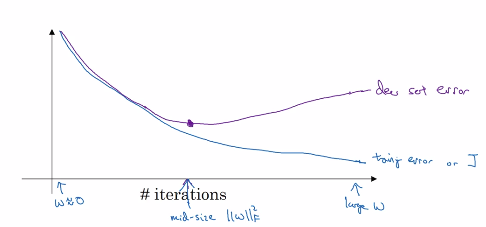
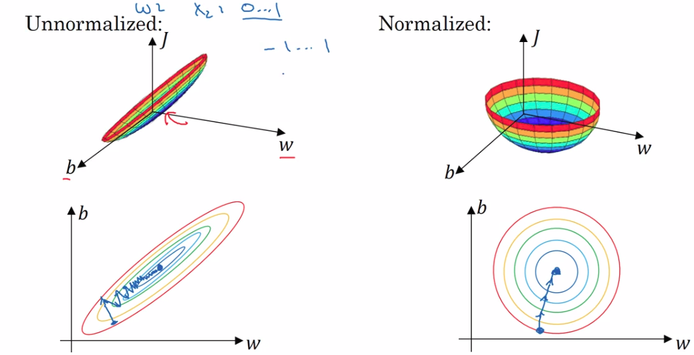

1. The train/dev/test split has become differently as "big data" is coming towards us.

   If you just want to build an machine learning application, it's okay if you don't have a separated test set(so just train/dev), since you may not need to get an unbiased performance measure of your model. But in case you want to compare your model to someone else's, you better have a train/dev/test split.

3. There hardly exists "bias variance trade off" anymore at the era of deep learning.

   First, we talk about what is "bias variance trade off". In the pre-deep-learning era, there are no many choices to both decrease bias and variance at the same time, so people often have to decide whether to decrease bias or to reduce model variance. But nowadays, with much more sophisticated tools(like Batch Norm, drop out, data augmentation and so on) and more data, we are able to ease off these two negative effect all together.

4. Two intuitions why regularization helps reduce over-fitting.

5. Some other regularization techniques

   - data augmentation

   - early stopping: why would it work? You initialize your network parameter with small random values and as you train the network the norm of the parameters increases. However, if you stop the training procedure halfway, the norm of the parameter matrix may not stray too far away(kind of like weight decay)

     

6. Normalizing inputs helps optimization.

   Normalizing your inputs will give roughly the same magnitude of gradients of the parameter, which may ease of the effect of jittering and speeds up training process.

   <center></center>

7. If you're using ReLU activation, you better use a Gaussian distribution of $\mathcal N(0, \frac{2}{n_{in}})$ to initialize the parameter to avoid the problem of gradient vanish or exploding. In python, you could do this in one line:

   ```Python
   w = np.random.randn(nin, nout) * (2 / nin)**0.5
   ```

   Let's do the math. We first define the calculation of one layer of neural network(ignoring the bias term and activation):
   $$
   \Large{
   \begin{split}
     z_i & = ReLU(x_i)\\
       y &= \sum_{i=1}^N w_iz_i\\
       \end{split}
   }
   $$
   The simplification of a deep neural network is just repeated matrix multiplication. Imagine you multiply a real number $a$ by a factor $q$ multiple times, you either end up being infinity(if q>1) or zero(if q<1). Only when you will get back $a$ itself if q equals to one. It's the same as matrix multiplication. Since we already normalize our inputs to have zero mean and unit variance, we would  want the output $y$ to have just the same variance as the input $x_i$ to avoid exploding and vanishing. So if we are to initialize the network from a Gaussian distribution $\mathcal N(0, \sigma^2)$, what $\sigma^2$ should be ? Now we list out the conditions(or assumption):

   $Var(x_i)=Var(y)=1$

   $z_i=ReLU(x_i)$

   $w_i \sim \mathcal N(0, \sigma^2)$

   And then we try to figure out the variance of $y$ in terms of $\sigma^2$:
   $$
   \Large{
       \begin{split}
       Var(y) &= Var(\sum_{i=1}^Nw_iz_i)\\
         &=\sum_{i=1}^NVar(w_iz_i)\\
         & = \sum_{i=1}^NVar(w_i)Var(z_i)\\
         &=\sum_{i=1}^{N/2}Var(w_i)Var(x_i) + 0\\
         & = \frac{N}{2}\sigma^2\\
         & = 1\\
       \end{split}
   }
   $$
   which says that $\sigma^2=\frac{2}{N}$. The first equation is the definition of variance of random variable. The second equation is the the basic property of random variable. Since parameter $w_i$ and input $z_i$ are assumed to be independent, we could use the property $Var(xy) = Var(x)Var(y)$. Besides, we are using ReLU activation, so half of $z_i$'s are zero while half of $z_i$'s equal to $x_i$'s, which gives the fourth equation. And at the end we can easily figure out $\sigma^2 = \frac{2}{N}$. Here, $N$ is usually the number of input units of the current neuron or equivalently, the number of output units of the previous layer.

   > In case you'r using a different activation, you should use a Gaussian distribution with different variance. Take tanh for example, the variance is $\frac{1}{N}$. 

8. What is an epoch?

   An epoch means a single forward through your training set.

8. Why should we favor mini-batch gradient descent over the other two extremes(SGD and BGD)?

   Batch gradient descent takes into account the whole training set to perform a single update. It's really time-consuming and not necessary since many of the training examples contribute the same to the final gradient(an extreme case is that all the training examples are identical). On the other hand, stochastic gradient descent(SGD) include one training example when calculating gradient every iteration. In this case, vectorization suffers. If you can carry ten bricks from one place to another, why bother carrying one every single time? So most of the time, you will use mini-batch gradient descent, which is time-efficient and consumes fewer memory.

9. What is bias correction in exponentially weighted averages?

   We usually use the following formula to maintain a moving average $v$ of some variable $\theta$:
   $$
   \Large{
       v_t = \beta v_{t-1}+(1-\beta)\theta_t
   }
   $$
   If we initialize $v$ to 0, then we are underestimating the value of $\theta$ at the first few iterations. Consider the following example:
   $$
   \Large{
   \begin{split}
   \beta&=0.9\\
       \theta_t &= \{40, 50, 30, 45,...\}\\
       v_t&={\{4.0,8.6,10.7,14.2...\}}\\
       gap&=\{36.0,41.4,19.3,30.8,...\}
       \end{split}
   }
   $$
   The huge gap between the running average and real value at time step $t​$ suggests that average is not reflecting the real situation. Bias correction does the job to correct the value of $v​$ at starting stage:
   $$
   \Large{
       v_t^{correct} = \frac{v_t}{1 - \beta^t}
   }
   $$
   Here we explain why exactly divided by $1-\beta^t$. Basically speaking, exponentially weighted average is performing the following calculation:
   $$
   \Large{
   \begin{split}
       v_t &= (1 - \beta)\theta_t + \beta v_{t-1}\\
       &=(1- \beta)\theta_t + \beta((1-\beta)\theta_{t-1}+\beta v_{t-1})\\
       &=...\\
       &=(1-\beta)\theta_t+\beta(1-\beta)\theta_{t-1} + ...+\beta^{t-1}(1-\beta)\theta_1 + \beta^tv_0\\
       &=(1-\beta)\theta_t+\beta(1-\beta)\theta_{t-1} + ...+\beta^{t-1}(1-\beta)\theta_1\\
       \end{split}
   }
   $$
   Take out the weights and sum them up:
   $$
   \Large{
       \begin{split}
       s &=(1-\beta)+\beta(1-\beta) + ...+\beta^{t-1}(1-\beta)\\
       &=(1-\beta)(1 +\beta+...+\beta^{t-1})\\
       &=(1-\beta)\frac{1-\beta^t}{1-\beta}\\
       &=1-\beta^t
       \end{split}
   }
   $$
   which is exactly $1-\beta^t$. So the corrected version matches the mathematical definition of weighted sum of variable $\theta$.

10. Tell in one sentence what momentum algorithm is doing?

   Build up velocity in direction with consistent gradient and smooth out velocity in direction with inconsistent gradient. As in the figure below, the derivative in the horizontal direction is consistent and thus will build up gradient during optimization process. Whereas in the vertical direction, the partial derivative may changes from negative(down) to positive(up) and thus may cancel out.

   <center></center>

   <caption><span> <u><font color='purple'>**Figure 3**</u><font color='purple'>: The red arrows shows the direction taken by one step of mini-batch gradient descent with momentum. The blue points show the direction of the gradient (with respect to the current mini-batch) on each step. Rather than just following the gradient, we let the gradient influence $v$ and then take a step in the direction of $v$.<br> <font color='black'> </span>

11. Local optima is not a severe problem for optimizing deep neural network.

    It turns out that there exists much more saddle points than local optimas when training a very large neural network. This phenomenon can be explained under probability theory(see DL book). People find out it's the problem of plateaus(large area with small gradients) that really slows down the training process. And many optimization algorithms(like Adam) have been come up with to tackle the problem of plateaus.

    ​