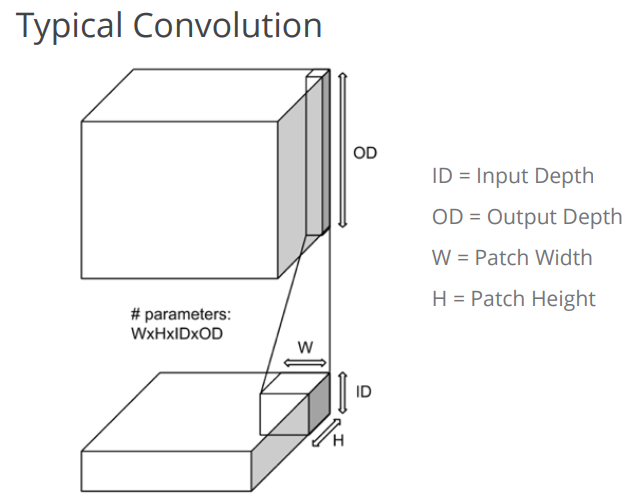
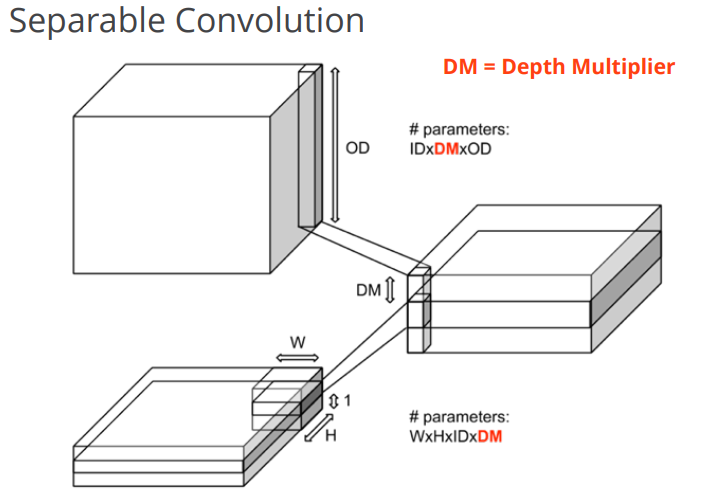
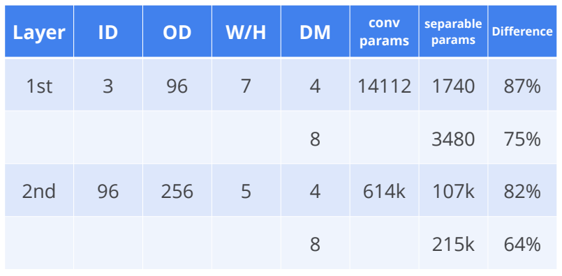

> Separable-Convolution

1. 普通的卷积

   

2. separable-conv

   

简单地来说，就是对输入的每个通道独立使用DM(Depth Multiplier)个卷积核，这样可以得到in_channels*DM个输出通道，这些个输出按通道连接在一起，然后在使用1\*1的卷积核得到out_channels的输出。

主要的好处是减少了参数的使用量，当然相应地会减少计算量，但对最终的结果影响不是很明显。

