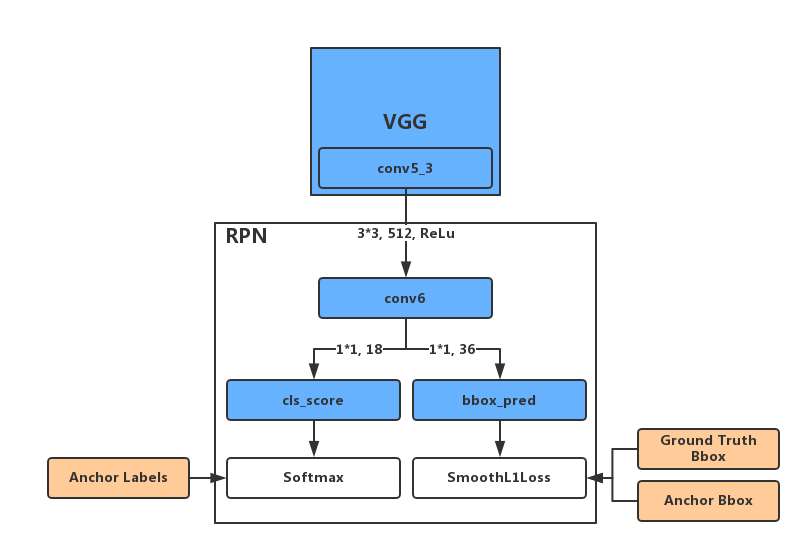
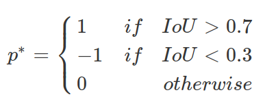

## Concepts

文章中有几个概念比较重要：

- anchor：又称anchor box，或者reference box。假设骨干网络提取的特征图谱大小为$w\times h$，那么这个特征图谱的每个坐标位置$\{(i, j), 0\le i\lt w, 0\le j < h\}$会对应图片中的9个anchor，这9个anchor具有不同的大小、比例。当然，具体来讲，anchor又还分为positive、negative以及non-positive and non-negative三种类别。
- ground truth box：很容易理解，就是物体所处的真实位置，这个数据集里会给出来。有一点要注意的是，每个positive anchor都会对应一个ground truth box。
- predicted box：也容易理解，就是网络的box预测输出。predicted box由anchor通过线性转换得到，然后我们希望predicted box和这个anchor对应的ground truth box比较接近。

## RPN的网络架构

具体的参数细节可以看看Caffe实现代码，[here](https://github.com/rbgirshick/py-faster-rcnn/blob/master/models/pascal_voc/VGG16/faster_rcnn_alt_opt/stage1_rpn_train.pt#L366)

简单解释一下一些参数：

conv6下面的分别使用了1\*1的卷积用于前景背景的概率预测和bbox的预测。"1\*1, 18"这个卷积层使用了18个卷积核，即“ 2(bg/fg) \* 9(anchors)=18”；另外，"1\*1, 36"这个卷积层使用了36个卷积核，即"4 \* 9(anchors) = 36".

anchor labels, 记为$P^*$，则：

## 4-Step Alternating Training

作者为了整个FPN和Fast-RCNN两个网络架构，于是提出了这个4步训练流程。首先，由于RPN和Fast-RCNN使用的骨干网络是相同的，所以为融合两个网络提供了可能。

1. 训练一个RPN
2. 用1）中得到的RPN生成proposal训练一个Fast-RCNN
3. 然后用2）中得到的Fast-RCNN的权值初始化RPN网络，但这时冻结骨干部分（即RPN和Fast-RCNN都共有的网络部分，如上图的VGG框），接着微调RPN独有的部分（上图中最大的矩形框）；
4. 同样冻结已有的骨干部分，然后微调Fast-RCNN独有的部分。

> 这4步可以再循环几次，但作者没发现有很明显的提升。就这个训练过程来看，在训练前期还是需要两个独立的网络的，但训练后期（第3步开始）就可以整合到一个网络里。

这样训练的好处：

- 首先是检测性能上的提升，mAP基本有提升1个百分点以上；
- 另外，由于RPN和Fast-RCNN共享了骨干网络特征，所以只需要计算一次卷积输出，这样一来RPN其实基本就没有引入计算开销

