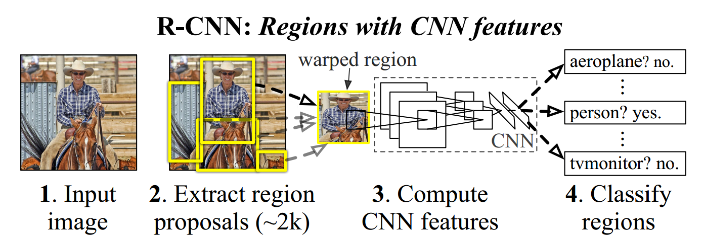

[TOC]

# RCNN

## Focus and Solution

- Localizing objects with a deep network.

  Region with CNN. And refine the region through regression.

- Training a high-capacity model with only a small quantity of annotated detection data.

  Supervised pre-training for an auxiliary task, followed by domain-specific fine-tuning.

## Pipeline

### Train Time

1. Input image
2. Use selective search method to extract around 2000 region proposals
3. Train a deep CNN
   1. Supervised pre-training: pre-train on ImageNet
   2. Domain-specific fine-tuning
      - replace last layer with randomly initialized parameter
      - training data: if IoU(ground truth, region proposal) > 0.5, positive example for that class; else negative example(background)
      - batch size: 128 = 32(p) + 96(n)
      - learning rate: 0.001(1/10th of the initial pre-training rate)
4. Train one linear SVM per class
   - training data: 
     - positive examples: ground truth bounding-boxes;
     - negative examples: IoU(ground truth, region proposal) < 0.3;
     - ignored examples: those IoU > 0.3 but not ground truth are ignored, see appendix B
   - Use the 4096-dimension feature vector to train $N$ class-specific linear SVM classifiers. Here, $N$ is the number of classes. Take VOC detection task for example, $N$ equals to 21(20 object classes plus 1 background class).

### Test Time

1. Input image
2. Use selective search method to extract around 2000 region proposals
3. Compute CNN features:
   1. Given a region proposal$(left, top, right, bottom)$, dig out together its surrounding $p=16$ pixels as context, so we get a dilated region$(left - p, top - p, right + p, bottom + p)$;
   2. Scale the dilated region to a fixed size of $224\times224$, which is the CNN input dimension
   3. Forward the scaled region through CNN to get a 4096-dimensional feature vector(fc7 output).
4. Score the region with trained linear SVM classifiers
   1. Given a 4096-dimensional vector, get $N$ scores for each class from the SVM classifier
   2. Choose the highest one as the final score(together with its class)
   3. Apply NMS for each class
5. Refine the region using the learned bounding box regressor.

## Statistics

**datasets**: VOC 2010-2012, ILSVRC2013

**result**: 

| dataset               | mAP(%) |
| --------------------- | ------ |
| VOC 2010              | 53.7   |
| VOC 2011/2012         | 53.3   |
| ILSVRC2013(200 class) | 31.4   |

> Result with AlexNet, if using VGG the mAP is better.

## Pros and Cons

## Key Points

1. What does the model name R-CNN mean for?

   Regions with CNN feature. R-CNN combines region proposals with deep CNN features. (At the time, there is an alternative: sliding-window paradigm)

2. Why read this paper?

   The very first paper that bridge the gap between image classification and object detection. There are many details worth knowing: like the parameterization of bounding-box regression, image warping, and so on.

3. What are the class-specific operations and class non-specific operations?

   class non-specific operations: selective search;

   class-specific operations: bounding-box regression; SVM; CNN;

4. Why use a separated SVM classifier?

   Short answer is that: the CNN result is worse. Below is a paragraph from appendix B.

   > This leads to the second issue: Why, after fine-tuning, train SVMs at all? It would be cleaner to simply apply the last layer of the fine-tuned network, which is a 21-way softmax regression classifier, as the object detector. **We tried this and found that performance on VOC 2007 dropped from 54.2% to 50.9% mAP.** This performance drop likely arises from a combination of several factors including that the definition of positive examples used in fine-tuning does not emphasize precise localization and the softmax classifier was trained on randomly sampled negative examples rather than on the subset of “hard negatives” used for SVM training.

   ​